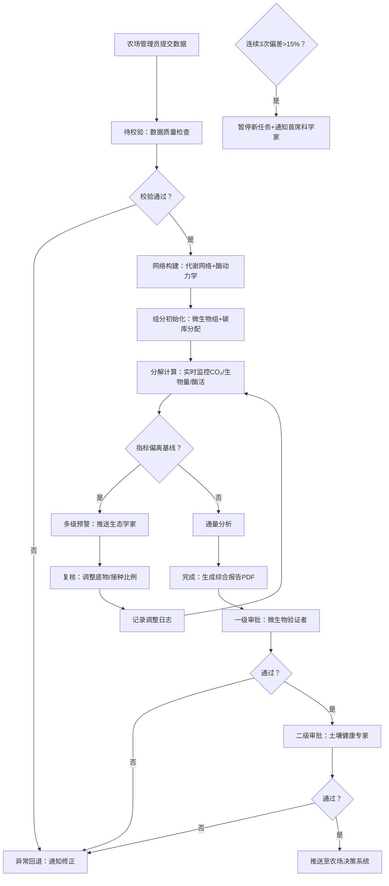

## 1. 产品概述

土壤微生物群落与有机碳分解多尺度模拟及智能管理平台，面向农业生态研究与农场精准管理，通过微生物代谢网络建模与酶动力学仿真，实现土壤碳循环过程的数字化模拟与智能决策支持。
- 核心价值：将宏基因组数据转化为可量化的碳分解预测模型，辅助土壤固碳方案优化，助力农业碳中和目标
- 目标用户：土壤生态学家、微生物验证者、土壤健康专家、农场管理者、首席科学家

## 2. 核心特性

### 2.1 用户角色与权限

| 角色 | 注册方式 | 核心权限 |
|------|----------|----------|
| 农场管理员 | 管理员邀请 | 上传土壤数据、发起模拟任务、查看报告、执行推荐方案 |
| 土壤生态学家 | 学术认证 | 复核预警事件、审核调整方案、导出科研数据 |
| 微生物验证者 | 专家认证 | 核查代谢网络合理性、审批模拟任务第一级 |
| 土壤健康专家 | 专家认证 | 确认管理方案、审批模拟任务第二级、推荐改良措施 |
| 首席科学家 | 超级管理员 | 全局配置、处理异常暂停、查看所有统计数据 |

### 2.2 功能模块划分

1. **数据上传中心**：土壤理化数据表单、宏基因组文件上传、数据质量校验
2. **模拟任务工作台**：任务列表、状态流转看板、实时监控面板、预警中心
3. **代谢网络构建器**：微生物群落可视化、代谢通路图、酶动力学参数配置
4. **分析报告中心**：综合报告PDF生成、数据导出、图表交互式浏览
5. **智能推荐引擎**：改良剂配比推荐、耕作方式优化、历史方案对比
6. **审批工作流**：两级审批界面、审批历史追踪、意见批注系统
7. **综合看板**：KPI统计卡片、模拟完成率趋势、预警响应热力图、微生物功能冗余雷达图
8. **系统管理**：用户权限管理、土壤类型配置、基线阈值设置、通知配置

### 2.3 页面详情清单

| 页面名称 | 模块名称 | 功能描述 |
|----------|----------|----------|
| 登录页 | 身份认证 | 角色选择登录、单点登录接入、双因素验证 |
| 综合看板 | 统计概览 | 模拟完成率趋势图、预警响应时长KPI、固碳增益统计、功能冗余雷达图、近期任务列表 |
| 数据上传页 | 理化数据表单 | pH/有机质/温湿度输入框、批量导入模板、数据实时校验提示 |
| 数据上传页 | 测序文件上传 | 拖拽上传区、文件格式校验、上传进度条、样本元数据关联 |
| 模拟任务列表 | 任务看板 | 状态泳道视图、任务筛选搜索、批量操作、异常标识 |
| 模拟详情页 | 状态时间轴 | 待校验→网络构建→组分初始化→分解计算→通量分析→完成→异常回退 全流程追踪 |
| 模拟详情页 | 实时监控面板 | CO₂通量实时曲线、微生物生物量堆叠图、胞外酶活性折线图、预警阈值参考线 |
| 模拟详情页 | 代谢网络可视化 | 菌群节点图、代谢通路连线、酶催化反应高亮、缩放与筛选交互 |
| 模拟详情页 | 预警处理区 | 预警级别徽章、偏离度指标、复核意见输入框、调整方案下拉选择 |
| 模拟详情页 | 两级审批区 | 第一级微生物验证者审批、第二级土壤健康专家审批、意见展示、推送至农场按钮 |
| 报告预览页 | 综合报告 | 碳分解速率曲线、群落组成堆叠图、酶活性热图、碳库变化趋势、调整日志附录 |
| 报告预览页 | 数据导出 | 土壤类型/施肥处理/时间窗口多维度筛选、CSV/Excel导出、批量下载队列 |
| 智能推荐页 | 方案推荐 | 改良剂配比滑块、耕作方式卡片、与历史方案对比雷达、预估固碳增益 |
| 系统管理 | 角色管理 | 用户列表、角色分配、权限矩阵编辑 |
| 系统管理 | 阈值配置 | CO₂基线配置、酶活性骤降阈值、15%偏差触发参数配置 |
| 通知中心 | 消息列表 | 预警推送、审批待办、系统公告、已读/未读筛选 |

## 3. 核心业务流程

用户上传土壤理化数据与宏基因组文件，系统经数据校验后自动构建代谢网络并初始化微生物组结构，随后进入分解计算与通量分析阶段。计算过程中实时监控关键指标，异常则触发预警推送生态学家复核，复核通过后自动调整参数重新模拟。模拟完成需经两级审批，通过后推送至农场决策系统。每日自动统计关键KPI并展示于综合看板。

## 4. 用户界面设计

### 4.1 设计风格

- **主色调**：深森林绿 `#1B4D3E` 作为品牌主色，搭配沃土棕 `#8B6914` 作为辅助色，米白 `#F5F1E8` 为基底，预警红 `#C0392B`、注意橙 `#E67E22`、成功绿 `#27AE60` 作为状态语义色
- **按钮风格**：圆角胶囊式按钮，主按钮为渐变森林绿带微阴影，悬浮时上浮动效；次要按钮为描边样式
- **字体方案**：标题使用 Lora 衬线字体彰显学术严谨，正文使用 IBM Plex Sans 保证数据可读性，数字/代码使用 JetBrains Mono
- **布局风格**：卡片式模块化布局，左侧导航+顶部状态栏+主内容区，数据面板采用等宽网格对齐
- **图标风格**：线性双色调图标，微生物相关采用拟态小圆点造型，数据图表使用渐变填充

### 4.2 页面设计要点

| 页面名称 | 模块名称 | UI元素与交互 |
|----------|----------|--------------|
| 综合看板 | 统计概览 | 顶部4张数据卡片带渐变背景与趋势箭头，中部左右双栏（左折线图+右雷达图），底部为预警热力图与任务列表，首屏加载带数字滚动动画 |
| 模拟详情页 | 实时监控面板 | 三图横向排列（CO₂曲线面积图/生物量堆叠面积图/酶活多线图），每条图带Y轴双刻度与阈值虚线，数据每秒刷新带平滑过渡动画 |
| 模拟详情页 | 状态时间轴 | 左侧垂直时间轴，7个状态节点分别对应不同颜色徽章，当前状态脉冲高亮，已完成状态带对勾图标，耗时信息悬浮展示 |
| 代谢网络可视化 | 网络图画布 | SVG交互式画布，节点大小代表菌群丰度，连线粗细代表代谢通量，支持框选缩放、节点悬浮详情、酶反应类型颜色图例 |
| 报告预览页 | 综合报告 | A4纸张样式卡片，章节锚点导航，图表支持点击放大，右上角"导出PDF"按钮带动画加载 |
| 智能推荐页 | 方案推荐 | 顶部配比滑块带实时预览，3种耕作方式卡片支持点击选中，对比雷达图随参数变化实时重绘，预估增益数字带渐变色 |

### 4.3 响应式设计

- 桌面端优先（1440px基准），主内容区最大宽度1600px
- 平板端（768-1024px）：导航折叠为抽屉，多图布局自适应为2列
- 移动端（<768px）：卡片堆叠单列，图表简化为关键指标+缩略图，复杂交互改为弹窗展示
- 所有数据表格支持横向滚动，触控按钮最小尺寸44px

### 4.4 动效与微交互

- 页面切换：渐入+10px上移动画，stagger延迟100ms
- 状态变更：节点脉冲发光→颜色填充→打勾动画（总时长600ms）
- 预警触发：卡片边框红光闪烁+轻微震动动效
- 数据刷新：图表曲线平滑插值过渡，不产生跳变
- 表单校验：错误输入框微抖动+下方错误信息渐入
