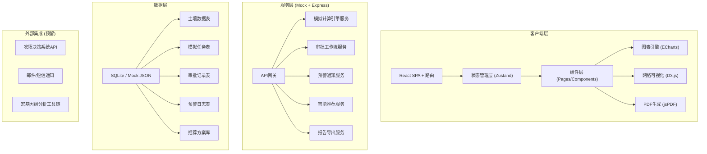
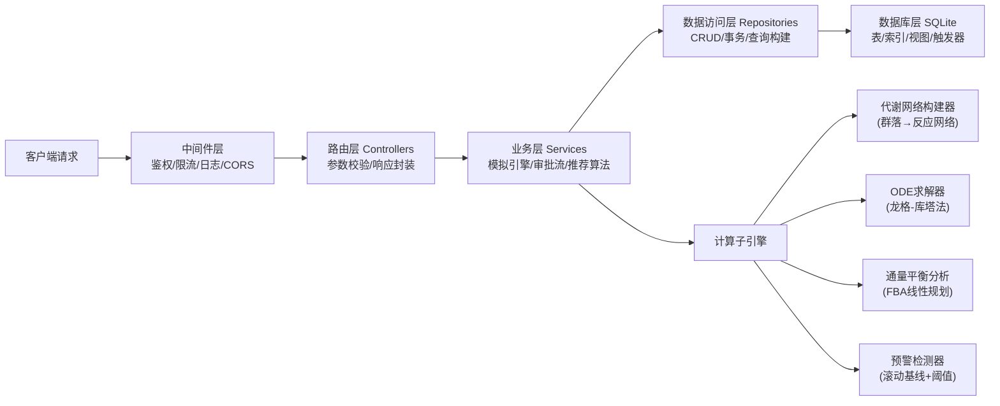

## 1. 架构设计



## 2. 技术选型说明

- **前端框架**：React@18 + TypeScript@5 + Vite@5，严格类型约束保证科研数据可靠性
- **样式方案**：TailwindCSS@3 + CSS变量主题系统，支持深浅色模式切换
- **状态管理**：Zustand@4，轻量不可变状态管理，配合 Immer 处理复杂状态更新
- **路由方案**：React Router@6，支持嵌套路由与路由级代码分割
- **图表可视化**：ECharts@5，覆盖折线图/堆叠面积图/热图/雷达图/桑基图全场景
- **网络可视化**：D3.js@7 + d3-force，实现微生物代谢网络力导向图
- **UI组件库**：Ant Design@5 基础组件二次封装（表格/模态框/表单），保持科研系统风格统一
- **HTTP请求**：Axios@1 + React Query@5，处理数据缓存/重试/乐观更新
- **PDF生成**：jsPDF@2 + html2canvas@1，前端直接生成报告PDF
- **表单校验**：React Hook Form@7 + Zod@3，运行时类型校验
- **动画库**：Framer Motion@11，处理页面切换/状态变更/图表过渡
- **后端**：Express@4（可选，用于复杂计算场景，默认内置Mock适配器）
- **数据存储**：前端 localStorage + IndexedDB 持久化，后端 SQLite

## 3. 路由定义

| 路由路径 | 页面名称 | 权限角色 | 说明 |
|----------|----------|----------|------|
| `/login` | 登录页 | 公开 | 角色选择登录入口 |
| `/dashboard` | 综合看板 | 全部角色 | KPI概览、雷达图、预警热力 |
| `/upload` | 数据上传 | 农场管理员、生态学家 | 理化数据+测序文件 |
| `/simulations` | 模拟任务列表 | 全部角色 | 看板视图/列表视图切换 |
| `/simulations/:id` | 模拟详情页 | 全部角色 | 状态追踪+实时监控+审批 |
| `/simulations/:id/network` | 代谢网络视图 | 生态学家、验证者 | 交互式网络可视化 |
| `/reports/:id` | 报告预览页 | 全部角色 | 综合报告+数据导出 |
| `/recommendations` | 智能推荐 | 专家、管理员 | 改良剂+耕作方案推荐 |
| `/approvals` | 审批中心 | 验证者、专家 | 两级审批待办列表 |
| `/notifications` | 通知中心 | 全部角色 | 预警/审批/系统消息 |
| `/admin/users` | 用户管理 | 首席科学家 | 角色权限管理 |
| `/admin/thresholds` | 阈值配置 | 首席科学家 | 基线/预警参数设置 |

## 4. 核心数据类型定义 (TypeScript)

```typescript
// 土壤理化数据
interface SoilPhysicochemicalData {
  id: string;
  sampleId: string;
  soilType: '黑土' | '红壤' | '黄壤' | '褐土' | '潮土' | '水稻土';
  pH: number;
  organicMatter: number;       // g/kg
  temperature: number;         // °C
  moisture: number;            // %
  totalNitrogen?: number;
  availableP?: number;
  clayRatio?: number;
  collectionDate: string;
  location?: { lat: number; lng: number };
}

// 宏基因组测序文件
interface MetagenomicsFile {
  id: string;
  sampleId: string;
  fileName: string;
  fileSize: number;
  fileType: 'FASTQ' | 'FASTA' | 'BAM' | 'VCF';
  uploadTime: string;
  sequencingPlatform?: 'Illumina' | 'Nanopore' | 'PacBio';
  qualityScore?: number;
  readCount?: number;
}

// 微生物物种
interface MicrobeSpecies {
  id: string;
  taxId: string;
  name: string;
  kingdom: string;
  phylum: string;
  class: string;
  order: string;
  family: string;
  genus: string;
  species: string;
  relativeAbundance: number;
  functions: string[];
}

// 碳库组分
interface CarbonPool {
  id: string;
  poolName: '活性碳库' | '慢性碳库' | '惰性碳库' | '微生物生物量碳' | 'DOC' | 'POC';
  initialAmount: number;       // mg/kg
  currentAmount: number;
  decompositionRate: number;   // 1/day
  turnoverTime: number;        // days
}

// 胞外酶
interface ExtracellularEnzyme {
  id: string;
  enzymeName: string;
  ecNumber: string;
  substrate: string;
  product: string;
  activity: number;            // nmol/g/h
  km: number;                  // Michaelis常数
  vmax: number;
  optimalPH: number;
  optimalTemp: number;
  encodingGenes: string[];
}

// 代谢反应
interface MetabolicReaction {
  id: string;
  reactionId: string;
  name: string;
  substrates: { compoundId: string; stoichiometry: number }[];
  products: { compoundId: string; stoichiometry: number }[];
  catalyst?: string;
  deltaG?: number;
  flux: number;                // mmol/gDW/h
  pathway?: string;
}

// 代谢网络
interface MetabolicNetwork {
  id: string;
  simulationId: string;
  nodes: {
    id: string;
    type: 'microbe' | 'compound' | 'enzyme' | 'reaction';
    label: string;
    abundance?: number;
    x?: number;
    y?: number;
  }[];
  edges: {
    source: string;
    target: string;
    weight: number;
    type: 'metabolize' | 'catalyze' | 'produce' | 'inhibit';
  }[];
}

// 模拟状态枚举
type SimulationStatus = 
  | 'PENDING_VALIDATION' 
  | 'NETWORK_BUILDING' 
  | 'COMPONENT_INITIALIZING' 
  | 'DECOMPOSITION_CALCULATING' 
  | 'FLUX_ANALYZING' 
  | 'COMPLETED' 
  | 'EXCEPTION_FALLBACK';

// 模拟任务
interface SimulationTask {
  id: string;
  taskNo: string;
  name: string;
  soilDataId: string;
  metagenomicsFileId?: string;
  status: SimulationStatus;
  statusHistory: {
    status: SimulationStatus;
    timestamp: string;
    operatorId?: string;
    remark?: string;
    durationMs?: number;
  }[];
  parameters: SimulationParameters;
  currentProgress: number;     // 0-100
  microbes: MicrobeSpecies[];
  carbonPools: CarbonPool[];
  enzymes: ExtracellularEnzyme[];
  network?: MetabolicNetwork;
  timeSeriesData: SimulationTimePoint[];
  warnings: WarningEvent[];
  adjustmentLogs: AdjustmentLog[];
  approvals: ApprovalRecord[];
  reportId?: string;
  farmPushedAt?: string;
  createdAt: string;
  createdBy: string;
  soilId?: string;
}

// 模拟参数
interface SimulationParameters {
  simulationDays: number;
  timeStepHours: number;
  temperatureModel: 'CONSTANT' | 'DIURNAL' | 'SEASONAL';
  moistureModel: 'CONSTANT' | 'RAINFALL';
  co2BaselineUpper: number;    // μmol/m²/s
  co2BaselineLower: number;
  enzymeDropThreshold: number; // %
  substrateAddition?: {
    type: string;
    amount: number;
    day: number;
  }[];
  microbeInoculation?: {
    speciesId: string;
    ratio: number;
    day: number;
  }[];
}

// 时间序列数据点
interface SimulationTimePoint {
  timeHour: number;
  co2Flux: number;             // μmol/m²/s
  microbialBiomass: number;    // mg/kg
  dissolvedOrganicC: number;
  particulateOrganicC: number;
  enzymeActivities: Record<string, number>;
  microbeAbundances: Record<string, number>;
  carbonPoolAmounts: Record<string, number>;
  temperature: number;
  moisture: number;
}

// 预警事件
type WarningLevel = 'INFO' | 'WARNING' | 'CRITICAL';

interface WarningEvent {
  id: string;
  simulationId: string;
  level: WarningLevel;
  type: 'CO2_DEVIATION' | 'ENZYME_DROP' | 'BIOMASS_COLLAPSE' | 'CONVERGENCE_FAIL';
  title: string;
  description: string;
  triggeredAt: string;
  hourPoint: number;
  metricName: string;
  baselineValue: number;
  actualValue: number;
  deviationPercent: number;
  acknowledgedBy?: string;
  acknowledgedAt?: string;
  reviewComment?: string;
  resolved: boolean;
}

// 调整日志
interface AdjustmentLog {
  id: string;
  simulationId: string;
  warningId?: string;
  adjustmentType: 'SUBSTRATE_ADD' | 'INOCULUM_RATIO' | 'PARAMETER_TWEAK' | 'NETWORK_REBUILD';
  beforeState: Record<string, unknown>;
  afterState: Record<string, unknown>;
  operatorId: string;
  operatorName: string;
  comment?: string;
  appliedAt: string;
  reSimulationCount: number;
}

// 审批记录
type ApprovalStage = 'MICROBE_VALIDATION' | 'SOIL_HEALTH_EXPERT';
type ApprovalResult = 'APPROVED' | 'REJECTED' | 'PENDING';

interface ApprovalRecord {
  id: string;
  simulationId: string;
  stage: ApprovalStage;
  result: ApprovalResult;
  approverId: string;
  approverName: string;
  approverRole: string;
  comment?: string;
  submittedAt?: string;
  decidedAt?: string;
  attachments?: string[];
}

// 推荐方案
interface Recommendation {
  id: string;
  soilId: string;
  soilType: string;
  amendmentMix: {
    name: string;            // 秸秆还田/有机肥/生物炭/绿肥/石灰
    ratio: number;           // t/ha
    unit: string;
  }[];
  tillageMethod: '免耕' | '少耕' | '深松' | '翻耕' | '旋耕';
  cropRotation?: string[];
  estimatedCarbonSequestration: number;  // t C/ha/year
  estimatedCost?: number;
  evidenceSimulations: string[];
  confidenceScore: number;    // 0-1
  createdAt: string;
}

// 综合报告
interface SimulationReport {
  id: string;
  simulationId: string;
  generatedAt: string;
  summary: {
    totalCo2Released: number;
    averageDecompositionRate: number;
    finalCarbonStock: number;
    sequestrationPotential: number;
  };
  figures: {
    carbonDecompositionCurve: string;       // base64 image
    communityCompositionStack: string;
    enzymeActivityHeatmap: string;
    carbonPoolTrend: string;
  };
  adjustmentLogAppendix: AdjustmentLog[];
  approvalAppendix: ApprovalRecord[];
}

// 日度统计看板数据
interface DailyDashboardStats {
  date: string;
  totalSimulations: number;
  completedSimulations: number;
  completionRate: number;
  failedSimulations: number;
  warningCount: number;
  criticalWarningCount: number;
  avgWarningResponseMinutes: number;
  totalCarbonGainKg: number;
  pendingApprovals: number;
  suspendedSoils: string[];
  functionalRedundancyRadar: {
    dimension: string;     // C循环/N循环/P循环/S循环/胁迫耐受/生长速率
    value: number;
  }[];
}
```

## 5. 服务端分层架构 (Express)



## 6. 数据模型 (ER图 + DDL)

### 6.1 ER图

```mermaid
erDiagram
    SOIL_PHYSICOCHEMICAL ||--o{ SIMULATION_TASK : "用于模拟"
    METAGENOMICS_FILE ||--o{ SIMULATION_TASK : "参考数据"
    SIMULATION_TASK ||--|{ SIMULATION_STATUS_HISTORY : "状态流转"
    SIMULATION_TASK ||--|{ MICROBE_SPECIES : "微生物组"
    SIMULATION_TASK ||--|{ CARBON_POOL : "碳库组分"
    SIMULATION_TASK ||--|{ EXTRACELLULAR_ENZYME : "胞外酶"
    SIMULATION_TASK ||--|| METABOLIC_NETWORK : "代谢网络"
    SIMULATION_TASK ||--|{ TIME_SERIES_POINT : "时间序列"
    SIMULATION_TASK ||--|{ WARNING_EVENT : "预警事件"
    WARNING_EVENT ||--o| ADJUSTMENT_LOG : "触发调整"
    SIMULATION_TASK ||--|{ APPROVAL_RECORD : "两级审批"
    SIMULATION_TASK ||--o|| SIMULATION_REPORT : "生成报告"
    USER_ROLE ||--|{ APPROVAL_RECORD : "审批人"
    USER_ROLE ||--|{ ADJUSTMENT_LOG : "操作人"
    RECOMMENDATION }o--|| SIMULATION_TASK : "参考模拟"
```

### 6.2 DDL (SQLite)

```sql
-- 用户与角色表
CREATE TABLE users (
    id TEXT PRIMARY KEY,
    username TEXT UNIQUE NOT NULL,
    full_name TEXT NOT NULL,
    email TEXT,
    phone TEXT,
    role TEXT NOT NULL CHECK (role IN ('FARM_ADMIN','ECOLOGIST','MICROBE_VALIDATOR','SOIL_EXPERT','CHIEF_SCIENTIST')),
    password_hash TEXT NOT NULL,
    status TEXT DEFAULT 'ACTIVE',
    created_at TEXT DEFAULT (datetime('now')),
    last_login_at TEXT
);

-- 土壤理化数据表
CREATE TABLE soil_physicochemical (
    id TEXT PRIMARY KEY,
    sample_id TEXT UNIQUE NOT NULL,
    soil_type TEXT NOT NULL,
    ph REAL NOT NULL CHECK (ph BETWEEN 0 AND 14),
    organic_matter REAL NOT NULL,
    temperature REAL,
    moisture REAL,
    total_nitrogen REAL,
    available_p REAL,
    clay_ratio REAL,
    collection_date TEXT NOT NULL,
    latitude REAL,
    longitude REAL,
    uploader_id TEXT NOT NULL REFERENCES users(id),
    created_at TEXT DEFAULT (datetime('now'))
);
CREATE INDEX idx_soil_type ON soil_physicochemical(soil_type);
CREATE INDEX idx_soil_date ON soil_physicochemical(collection_date);

-- 宏基因组文件表
CREATE TABLE metagenomics_files (
    id TEXT PRIMARY KEY,
    sample_id TEXT NOT NULL REFERENCES soil_physicochemical(sample_id),
    file_name TEXT NOT NULL,
    file_size INTEGER NOT NULL,
    file_type TEXT NOT NULL,
    file_path TEXT,
    sequencing_platform TEXT,
    quality_score REAL,
    read_count INTEGER,
    uploader_id TEXT NOT NULL REFERENCES users(id),
    uploaded_at TEXT DEFAULT (datetime('now'))
);

-- 模拟任务主表
CREATE TABLE simulation_tasks (
    id TEXT PRIMARY KEY,
    task_no TEXT UNIQUE NOT NULL,
    name TEXT NOT NULL,
    soil_data_id TEXT NOT NULL REFERENCES soil_physicochemical(id),
    metagenomics_file_id TEXT REFERENCES metagenomics_files(id),
    soil_id TEXT,
    status TEXT NOT NULL DEFAULT 'PENDING_VALIDATION',
    current_progress INTEGER DEFAULT 0,
    parameters_json TEXT NOT NULL,
    network_json TEXT,
    created_by TEXT NOT NULL REFERENCES users(id),
    report_id TEXT,
    farm_pushed_at TEXT,
    created_at TEXT DEFAULT (datetime('now')),
    updated_at TEXT DEFAULT (datetime('now'))
);
CREATE INDEX idx_sim_status ON simulation_tasks(status);
CREATE INDEX idx_sim_soil ON simulation_tasks(soil_id);
CREATE INDEX idx_sim_created ON simulation_tasks(created_at);

-- 状态流转历史
CREATE TABLE simulation_status_history (
    id TEXT PRIMARY KEY,
    simulation_id TEXT NOT NULL REFERENCES simulation_tasks(id),
    status TEXT NOT NULL,
    timestamp TEXT DEFAULT (datetime('now')),
    operator_id TEXT REFERENCES users(id),
    remark TEXT,
    duration_ms INTEGER
);
CREATE INDEX idx_status_sim ON simulation_status_history(simulation_id);

-- 微生物物种
CREATE TABLE microbe_species (
    id TEXT PRIMARY KEY,
    simulation_id TEXT NOT NULL REFERENCES simulation_tasks(id),
    tax_id TEXT,
    scientific_name TEXT NOT NULL,
    kingdom TEXT,
    phylum TEXT,
    class TEXT,
    order_name TEXT,
    family TEXT,
    genus TEXT,
    species TEXT,
    relative_abundance REAL NOT NULL,
    functions_json TEXT
);
CREATE INDEX idx_microbe_sim ON microbe_species(simulation_id);

-- 碳库组分
CREATE TABLE carbon_pools (
    id TEXT PRIMARY KEY,
    simulation_id TEXT NOT NULL REFERENCES simulation_tasks(id),
    pool_name TEXT NOT NULL,
    initial_amount REAL NOT NULL,
    current_amount REAL NOT NULL,
    decomposition_rate REAL,
    turnover_time REAL
);

-- 胞外酶
CREATE TABLE extracellular_enzymes (
    id TEXT PRIMARY KEY,
    simulation_id TEXT NOT NULL REFERENCES simulation_tasks(id),
    enzyme_name TEXT NOT NULL,
    ec_number TEXT,
    substrate TEXT,
    product TEXT,
    activity REAL,
    km REAL,
    vmax REAL,
    optimal_ph REAL,
    optimal_temp REAL,
    encoding_genes_json TEXT
);

-- 时间序列数据
CREATE TABLE time_series_points (
    id TEXT PRIMARY KEY,
    simulation_id TEXT NOT NULL REFERENCES simulation_tasks(id),
    time_hour INTEGER NOT NULL,
    co2_flux REAL NOT NULL,
    microbial_biomass REAL,
    doc REAL,
    poc REAL,
    enzyme_activities_json TEXT,
    microbe_abundances_json TEXT,
    carbon_pool_amounts_json TEXT,
    temperature REAL,
    moisture REAL
);
CREATE INDEX idx_ts_sim_time ON time_series_points(simulation_id, time_hour);

-- 预警事件
CREATE TABLE warning_events (
    id TEXT PRIMARY KEY,
    simulation_id TEXT NOT NULL REFERENCES simulation_tasks(id),
    level TEXT NOT NULL,
    type TEXT NOT NULL,
    title TEXT NOT NULL,
    description TEXT,
    triggered_at TEXT DEFAULT (datetime('now')),
    hour_point INTEGER,
    metric_name TEXT,
    baseline_value REAL,
    actual_value REAL,
    deviation_percent REAL,
    acknowledged_by TEXT REFERENCES users(id),
    acknowledged_at TEXT,
    review_comment TEXT,
    resolved INTEGER DEFAULT 0
);
CREATE INDEX idx_warning_sim ON warning_events(simulation_id);
CREATE INDEX idx_warning_level ON warning_events(level, resolved);

-- 调整日志
CREATE TABLE adjustment_logs (
    id TEXT PRIMARY KEY,
    simulation_id TEXT NOT NULL REFERENCES simulation_tasks(id),
    warning_id TEXT REFERENCES warning_events(id),
    adjustment_type TEXT NOT NULL,
    before_state_json TEXT,
    after_state_json TEXT,
    operator_id TEXT NOT NULL REFERENCES users(id),
    operator_name TEXT NOT NULL,
    comment TEXT,
    applied_at TEXT DEFAULT (datetime('now')),
    re_simulation_count INTEGER DEFAULT 0
);

-- 审批记录
CREATE TABLE approval_records (
    id TEXT PRIMARY KEY,
    simulation_id TEXT NOT NULL REFERENCES simulation_tasks(id),
    stage TEXT NOT NULL,
    result TEXT NOT NULL DEFAULT 'PENDING',
    approver_id TEXT NOT NULL REFERENCES users(id),
    approver_name TEXT NOT NULL,
    approver_role TEXT NOT NULL,
    comment TEXT,
    submitted_at TEXT,
    decided_at TEXT
);
CREATE INDEX idx_approval_sim_stage ON approval_records(simulation_id, stage);

-- 推荐方案
CREATE TABLE recommendations (
    id TEXT PRIMARY KEY,
    soil_id TEXT,
    soil_type TEXT NOT NULL,
    amendment_mix_json TEXT NOT NULL,
    tillage_method TEXT NOT NULL,
    crop_rotation_json TEXT,
    estimated_carbon_seq REAL NOT NULL,
    estimated_cost REAL,
    evidence_simulations_json TEXT,
    confidence_score REAL,
    created_at TEXT DEFAULT (datetime('now'))
);

-- 综合报告
CREATE TABLE simulation_reports (
    id TEXT PRIMARY KEY,
    simulation_id TEXT NOT NULL UNIQUE REFERENCES simulation_tasks(id),
    generated_at TEXT DEFAULT (datetime('now')),
    summary_json TEXT NOT NULL,
    figures_json TEXT NOT NULL,
    pdf_path TEXT,
    pdf_blob BLOB
);

-- 土壤异常暂停记录
CREATE TABLE soil_suspension_records (
    id TEXT PRIMARY KEY,
    soil_id TEXT NOT NULL,
    simulation_ids_json TEXT NOT NULL,
    max_deviation REAL NOT NULL,
    triggered_at TEXT DEFAULT (datetime('now')),
    resolved_at TEXT,
    resolver_id TEXT REFERENCES users(id),
    note TEXT
);

-- 初始化基础用户
INSERT INTO users (id, username, full_name, email, role, password_hash) VALUES
('u_farm_01', 'farm_admin', '王管理员', 'wang@farm.cn', 'FARM_ADMIN', '***'),
('u_eco_01', 'ecologist', '李生态学家', 'li@eco.cn', 'ECOLOGIST', '***'),
('u_mv_01', 'microbe_val', '张验证者', 'zhang@lab.cn', 'MICROBE_VALIDATOR', '***'),
('u_se_01', 'soil_expert', '赵健康专家', 'zhao@soil.cn', 'SOIL_EXPERT', '***'),
('u_cs_01', 'chief_sci', '钱首席科学家', 'qian@acad.cn', 'CHIEF_SCIENTIST', '***');
```
